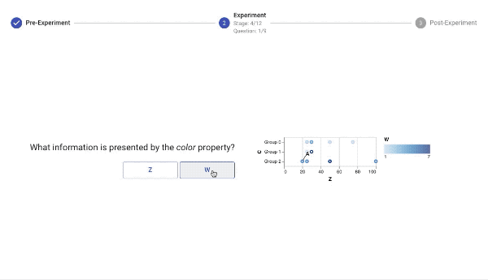

# VizNet: Data, System, and Analysis
This repository contains **scripts to retrieve the four corpora** (Plotly, ManyEyes, Webtables, Open Data Portal), **characterize those datasets** with statistical features, and **sample high-quality CQQ datasets** within constraints to replicate Kim and Heer (EuroVis 2018). We also include the code and instructions for running the **experimental system**. In the future, we will provide anonymized experimental results and associated analysis scripts.

## Contents
```
viznet
└───raw/
    └───retrieve_corpora.sh: Shell script to download and unzip raw corpora
└───characterization/
    └───extract_features.py: Entry point for extracting features from a specific corpus 
    └───feature_extraction/: Modules for extracting and aggregating features from datasets
    └───Descriptive Statistics.ipynb: Notebook for visualizing and characterizing dataset features
└───experiment/
    └───Data Quality Assessment.ipynb: Code to assess measures of data quality for experiment datasets
    └───sample_CQQ_specs_with_data.py: Script to sample CQQ specifications from corpora subject to experimental constraints
    └───Question Generation.ipynb: Notebook to generate experimental questions from CQQ specifications
    └───questions.json: Questions presented to users in experiment
    └───data/: 12,000 datasets used in experiment
    └───system/: front-end and back-end code used to run experiment
        └─── README.md: instructions to run the experimental system
    └───screenshots/: screen shots from deployed experiemnt
└───analysis/
    └───results/: Results of full replication experiment
    └───Experiment Analysis.ipynb: Code to analyze the experimental results
└───helpers/
    └───read_raw_data.py: Functions for reading original raw data files as raw Pandas data frames
    └───preprocessing/: Utility functions for extracting features from tables for predictive modeling
```

## Downloading the Data
The four corpora are stored in Amazon S3 buckets. To download and unzip the data, run `sh ./retrieve_corpora.sh` in the `raw` directory.

## Usage 
1. In the base directory, initialize and activate virtual environment: `virtualenv -p python3 venv && source venv/bin/activate`
2. Install Python dependencies: `pip install -r requirements.txt`
3. Start Jupyter notebook: `jupyter notebook`

## Running Experiment


The experiment frontend is implemented in React/Redux. The backend is implemented in Python, and uses Flask as an API layer with PostgreSQL as a database. Instructions for running the experiment are provided in [`experiment/README.md`](experiment/README.md)
