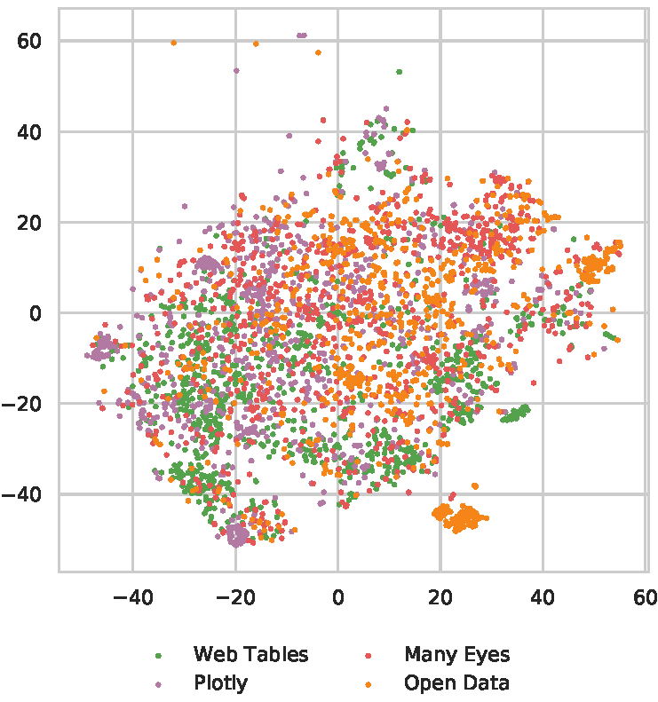

# VizNet: Data, System, and Analysis
This repository includes scripts to **retrieve the four corpora** (Plotly, ManyEyes, Webtables, Open Data Portal) included in VizNet, **characterize those datasets** with statistical features, **sample high-quality datasets** within constraints to replicate Kim and Heer (EuroVis 2018), and **run the experimental system** for crowdsourced evaluation.

## What is VizNet?
Collecting, curating, and cleaning data is a laborious and expensive process. Visualization researchers have relied on running studies with ad hoc, sometimes synthetically generated, datasets. However, such datasets do not display the same characteristics as data found in the wild. **VizNet is a centralized and large-scale repository of data** as used _in practice_, compiled from the web, open data repositories, and online visualization platforms.


_VizNet enables data scientists and visualization researchers to aggregate data, enumerate visual encodings, and crowdsource
effectiveness evaluations._

## What is VizNet useful for?

Researchers can use the VizNet repository to **conduct studies with real world data**. For example, we have used VizNet to [replicate](/assets/replication_results.png) a [study assessing the influence](https://idl.cs.washington.edu/files/2018-TaskDataEffectiveness-EuroVis.pdf) of task and data distribution on the effectiveness of visual encodings. We then train a machine learning model to [predict perceptual effectiveness](/assets/gbr_log_response_time_regression.png) of _(data, visualization, task) triplets_. Such learned models could be used to power visualization recommendation systems. We also provide scripts for [sampling high-quality data](/experiment/sample_CQQ_specs_with_data.py) subject to experimental constraints, [verifying data quality](/experiment/Data%20Quality%20Assessment.ipynb) of samples, and a [system](/experiment/system) for crowdsourcing effectiveness evaluations. We will provide anonymized experimental results and associated analysis scripts shortly.



If experiment design demands the use of synthetically generated data, researchers can **assess the ecological validity of synthetic data** by comparing against real distributions. We provide an [overview](assets/datasets-one-pager.pdf) of statistical properties of datasets within VizNet, a [script](characterization/extract_features.py) for extracting statistical features from the corpora, a [notebook](characterization/Descriptive%20Statistics.ipynb) for characterizing the features, and a [notebook](experiment/Cluster%20CQQ%20Features.ipynb) for clustering datasets embedded in a two-dimensional latent space, as shown in the figure to the left. Each data point is a table from one of the four data sources included in VizNet, which is encoded using color.

By using data from the VizNet repository, or data characterized along similar dimensions, researchers can compare design techniques against a common baseline.

Lastly, VizNet can be used for more than visualization research. For example, we are currently developing a [machine learning approach to semantic type detection](/assets/sherlock-screenshot.png) using the VizNet repository. We also anticipate researchers using VizNet to study and develop measures of [data](http://web.mit.edu/tdqm/www/tdqmpub/PipinoLeeWangCACMApr02.pdf) [quality](http://dc-pubs.dbs.uni-leipzig.de/files/Rahm2000DataCleaningProblemsand.pdf), which is an important feature of large-scale repositories.

## What's in this repository?
```
raw/
    └───retrieve_corpora.sh: Shell script to download and unzip raw corpora
characterization/
    └───extract_features.py: Entry point for extracting features from a specific corpus
    └───feature_extraction/: Modules for extracting and aggregating features from datasets
    └───Descriptive Statistics.ipynb: Notebook for visualizing and characterizing dataset features
experiment/
    └───Data Quality Assessment.ipynb: Code to assess measures of data quality for experiment datasets
    └───sample_CQQ_specs_with_data.py: Script to sample CQQ specifications from corpora subject to experimental constraints
    └───Cluster CQQ Features.ipynb: Script to cluster CQQ features
    └───Question Generation.ipynb: Notebook to generate experimental questions from CQQ specifications
    └───questions.json: Questions presented to users in experiment
    └───data/: 12,000 datasets used in experiment
    └───system/: front-end and back-end code used to run experiment
        └─── README.md: instructions to run the experimental system
    └───screenshots/: screen shots from deployed experiment
helpers/
    └───read_raw_data.py: Functions for reading original raw data files as raw Pandas data frames
    └───preprocessing/: Utility functions for extracting features from tables for predictive modeling
```

## How do I use this repository?
This repository supports multiple usecases. For users who want to **access the raw data**, we store the four corpora in an Amazon S3 bucket. To download and unzip the data, run `sh ./retrieve_corpora.sh` in the `raw` directory. Note that the uncompressed datasets take up ~657Gb. We will provide samples of the dataset shortly.

If you want to **run the code**, note that all processing scripts and notebooks are written in Python 3. To get started:
1. In the base directory, initialize and activate virtual environment: `virtualenv -p python3 venv && source venv/bin/activate`
2. Install Python dependencies: `pip install -r requirements.txt`
3. Start Jupyter notebook or Jupyter lab: `jupyter notebook` or `jupyter lab`

To **run the crowdsourced experiment**, please follow the instructions provided in [`experiment/README.md`](experiment/README.md)
. The experiment frontend is implemented in React/Redux. The backend is implemented in Python, and uses Flask as an API layer with PostgreSQL as a database. To customize this system for your own experiment, you can modify the [list of questions](experiment/questions.json), [referenced datasets](experiment/data), and [visual specifications](/experiment/system/frontend/src/specs.json).

<p align="center">
    <i>Pre-experiment screening questions</i>
</p>

<p align="center">
    <kbd></kbd>
</p>

<p align="center">
    <i>Main portion of VizNet crowdsourced replication experiment</i>
</p>

<p align="center">
    <kbd></kbd>
</p>
